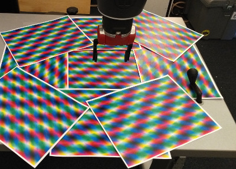
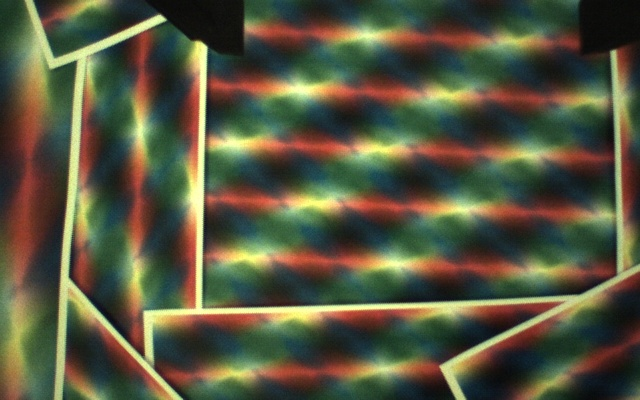
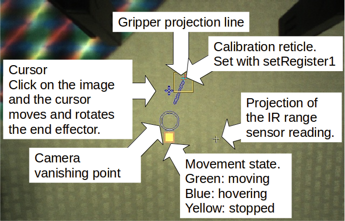

Next we will calibrate the robot so that it can map between image
coordinates and world coordinates.  This process takes several steps.
Calibration data is stored in the directory 'default/config_<your
robot's serial>'.  There is one file with robot-specific parameters
such as table height, and a separate directory for each camera.

### Make a magic circle
First, print out about 10 pages of [magic paper](
https://github.com/h2r/ein/raw/master/images/calibration/magicpaper.pdf).
Send the gripper to the home position by running `goHome`. (If you
would like to change the home position, follow [these
instructions](../movement/#changing-the-home-position).)  Then drive
down to close to the table height using `zDown`.  Create a magic
circle underneath the gripper as depicted here:



The goal is for the magic circle to fill the wrist camera's field of
view as the arm moves up.  The magic paper contains a superposition of
three plane waves at different orientations and colors.  It is
textured at every point, allowing the robot to set its calibration
parameters by making known movements.

### Set the table height

Ein assumes there is a planar horizontal table and stores the height
of this table for use in various calculations and motions.  It can set
the table height using the robot's range sensor. To set the table
height, first `goHome`, then use `zDown` to move the arm so that the
IR sensor is approximately 10cm from the table.  (The short grippers
should be a centimeter or two above the table.) Run `setTable` to use
the IR sensor to set the table height.  You should see the console
print information about the process; it takes multiple readings and
waits for them to stablize.  At the end it will print the table
height.  The numbers should be changing slightly, and the final delta
should be small.

### Set the camera parameters

Baxter's wrist camera uses automatic adjustment of gain, exposure, and
color settings.  However these automatic adjustments prevent our
system from reliably detecting objects it has previously seen.  Our
solution is to set them once to good values and fix them.  To set these parameters, start with this command:

```80 25 1124 1024 2048 fixCameraLighting```

The parameters are:
```<gain> <exposure> <red> <green> <blue> fixCameraLighting```

First tune the gain, then the exposure, and then adjust the color if
necessary.  You can set it to the automatic parameters with
`fixCameraLightingToAutomaticParameters`.  This word will set the
camera to automatic control, then fix the parameters to the
automatically adjusted values.  You can observe these values with the
variables `cameraGain`, `cameraExposure`, `cameraWhiteBalanceRed`,
`cameraWhiteBalanceGreen`, `cameraWhiteBalanceBlue`.    

To save these settings to disk (so they will be loaded automatically every time Ein starts), run:
```
saveCalibration
```

An example of a
reasonably well adjusted (slightly yellow) wrist view image of magic
paper is here:  



### Set the gripper mask

Ein needs to know the location of the grippers in its wrist camera
image in order to ignore those pixels when mapping its tabletop
environment.  To set the gripper mask run `setGripperMaskWithMotion`.
View the progress in the window "Object Viewer."  At the beginning the
window will be blue; as it moves, high-variance parts of the averaged
image are considered not part of the gripper mask; low variance parts
are considered as part of the mask.  You should see something like
what appears below:


Verify that the blue region completely covers the grippers when they
are open, and that there is no extra blue areas remaining.  If this
does not work, recenter the gripper (`goHome`) and try again.  You may
need to rearrange the magic circle or adjust the lighting or colors on
your camera.  When the mask looks good, you can stop the process by
running `clearStacks`.  It saves after every iteration.


<!--
### Calibrate the height reticles

Next we need to set the projection of the gripper in the image at
different heights.  This allows Ein to map between pixel space and
global space given the camera pose.    We set the magnification using
interpolation based on several sample points.  The target is obtained
by rotating the gripper in a plan and finding the minimum variance
point at each point.  

To do this process first `goHome` and then run
`calibrateRGBCameraIntrinsics`.
-->

The gripper will move to four different heights and take a series of
measurements at different orientations.  This process takes about 20
minutes to complete.  Because Ein is single threaded, the gui will
periodically freeze while it is running the inference; this freezing
does not mean it is broken.   If it fails you may have to run it again;
in that case restart Ein or run `loadCalibration` to reload your old
calibration (which, while not perfect, is a reasonable
initialization).  When you obtain a good calibration (described
below), save it by running `saveCalibration`.

### Check the calibration

To check the calibration, you need to learn more about the wrist view.
We have included a legend showing the various reticles and markers
below.




#### Exercise:  Explore the movement state. 

Move the arm with large and small movements.  Observe the movement
state indicator; watch as it changes from moving to hovering to
stopped.  You can try large movements by double clicking in the Object
Map Viewer; this action sends the arm to the corresponding position.  

#### Exercise: Check the calibration.  

To check the calibration, verify that the gripper projection line
appears as shown in the above legend.  It should be a relatively
straight line, no zig-zags or curves.  It should also not be absent.
If there is a problem, rearrange the magic circle and try the
calibration again.  Do not hesitate to post an issue if you have
problems.

Second, find the calibration reticle, drawn in red and green near the
gripper projection line.  Drive the arm so that the calibration
reticle is above a well-distinguished point in the image.  In the
sequence below, we did this so the crosshairs were above the penny.
Then run `saveRegister1` to save this location.  It will create a new
reticle drawn at this point in global space.  Then drive the arm
around in the neighborhood and verify this reticle appears in the same
space.  Be sure to check movements in all axes (x, y, and z), as
sometimes a calibration will work well in one dimension and not
others.  Some example images are shown below, using a penny as a
marker.

This calibration is somewhat imperfect; the reticle stays inside the
penny but ideally it would be centered inside the penny, perfectly
picking out the global location in the image.   


<br/>


Here is a bad calibration, where the gripper
calibration line is absent:


Here is bad calibration where it goes in the opposite direction:

